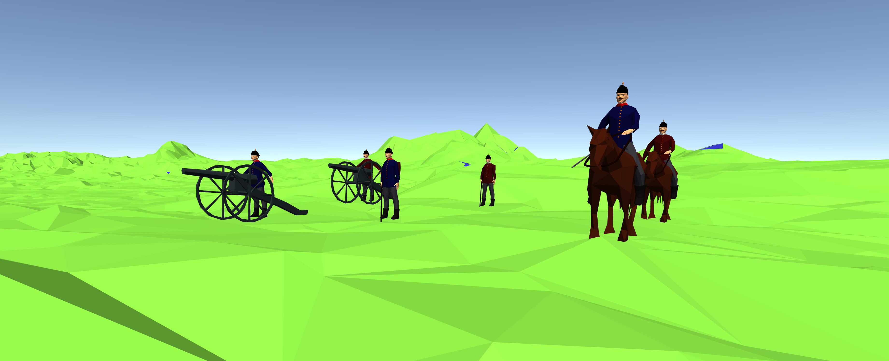

# WHK-Battlesim

Der WHK-Battlesim nutzt die Wilhelmshöher Kriegskarten, um historische Schlachten zu simulieren und zu visualisieren. Auf Basis der in den Karten eingezeichneten Aufstellung wird der Kampfablauf übersichtlich und verständlich dargestellt. Der Nutzer kann dabei in einer anpassbaren 3D-Vogelperspektive das Kampfgeschehen verfolgen. Zusätzlich ist es möglich, die historische Truppenaufstellung anzupassen, um alternative Schlachtabläufe auszutesten. Um ein möglichst realitätsnahes Ergebnis zu erzielen, werden die Einheiten und ihre Eigenschaften wie die Truppenstärke und die Einheitenklasse (Infanterie, Kavallerie, ...), sowie die darauf basierenden Strategien individuell simuliert.

Die Wilhelmshöher Kriegskarten dokumentieren diverse historische Kriegsschauplätze und Kriegsereignisse. Da Karten naturgemäß statisch sind, können Schlachtabläufe höchstens in Textform aufgezeichnet werden. Somit ist die Vorstellungskraft des Betrachters für die Visualisierung der Truppenbewegungen verantwortlich. Da dies durch die große Anzahl der beteiligten Soldaten praktisch unmöglich wird, haben wir mit dem WHK-Battlesim eine Möglichkeit geschaffen, den Verlauf übersichtlich darzustellen.

Der WHK-Battlesim ist eine Kampfsimulation, die basierend auf der Aufstellung den Schlachtverlauf berechnet und übersichtlich visualisiert. Dabei werden einzelne Einheiten unabhängig simuliert, um möglichst realitätsnahe Ergebnisse zu erziehlen. Einheiten können sich individuell bewegen und bei Feindkontakt automatisch in den Kampf eingreifen. Weiterhin wird neben grundlegenden Werten wie der Anzahl an Soldaten pro Einheit und dem erlittenen Schaden auch die Moral simuliert, um auch Ereignisse wie Kapitulation eingekesselter Truppen nachstellen zu können. Die unterschiedlichen Einheitenklassen wie Infanterie, Kavallerie und Artillerie haben dabei individuell angepasste Eigenschaften wie Geschwindigkeit, Reichweite und Angriffsstrategien, um die unterschiedlichen Bestandteile einer Armee und deren Einsatzgebiete realistisch darzustellen.

Die Kartendaten wurden genutzt, um die Aufstellungen ausgewählter Schlachten im Battlesim zu rekonstruieren. Dabei werden neben den historischen Situationen auch vom Nutzer angepasste Aufstellungen unterstützt, wodurch als Alternative zum echten Schlachtverlauf auch ""Was-wäre-wenn""-Szenarien simuliert werden können.

Um die Visualisierung übersichtlich zu gestalten, wurde ein minimalistische Low-Poly-Stil gewählt, wobei der Nutzer in einer anpassbaren Vogelperspektive das Schlachtfeld überblickt. Im Gegensatz zu den zweidimensionalen Karten sind durch diese dreidimensionale Darstellung unter anderem die topologischen Eigenschaften des Schlachtfelds besser erkennbar. Die unterscheidlichen Einheiten sind einfach unterscheidbar. Weiterhin werden in der Visualisierung statt einzelner Soldaten nur gesamte Einheiten dargestellt, wodurch die Übersichtlichkeit weiter verbessert wird.

Der WHK-Battlesim ist eine Desktopanwendung, die in Unity mithilfe von C# geschrieben wurde. Zusätzlich zu den Wilhelmshöher Kriegskarten wurden Terraindaten der Schlachtfelder genutzt, um Eigenschaften wie die Höhe und Neigung des Untergrunds, sowie Informationen über Hindernisse wie Seen und Flüsse in die Simulation einfließen zu lassen.
